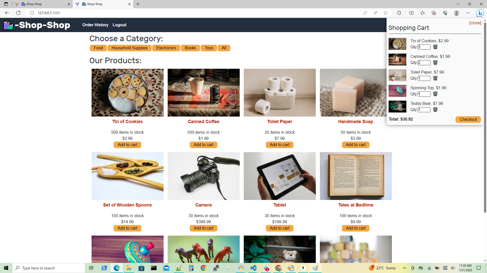

## 20_react_portfolio

## Description:-

1. 20_react_portfolio is a single-page application portfolio for a web developer.

2. WHEN recruiter load the portfolio. THEN he will presented with a page containing a header, a section for content, and a footer.

3. WHEN recruiter view the header. THEN he will presented with the developer’s name and navigation with titles corresponding to different sections of the portfolio.

4. WHEN recruiter view the navigation titles. THEN he will presented with the titles About Me, Portfolio, Contact, and Resume, and the title corresponding to the current section is highlighted

5. WHEN recruiter click on a navigation title. THEN he will presented with the corresponding section below the navigation without the page reloading and that title is highlighted

6. WHEN recruiter load the portfolio the first time. THEN the About Me title and section are selected by default.

7. WHEN recruiter presented with the About Me section. THEN he will see a recent photo or avatar of the developer and a short bio.

8. WHEN recruiter presented with the Portfolio section. THEN he will titled images of six of the developer’s applications with links to both the deployed applications and the corresponding GitHub repository.

9. WHEN recruiter presented with the Contact section. THEN he will get a contact form with fields for a name, an email address, and a message

10. WHEN recruiter move his cursor out of one of the form fields without entering text. THEN he will receive a notification that this field is required

11. WHEN recruiter enter text into the email address field. THEN he will receive a notification if he entered an invalid email address

12. WHEN recruiter presented with the Resume section. THEN he will see a link to a downloadable resume and a list of the developer’s proficiencies

13. WHEN recruiter view the footer. THEN he will presented with text or icon links to the developer’s GitHub and LinkedIn profiles, and their profile on a third platform (Stack Overflow, Twitter) 

## Table of Contents

 *  [Installation](#installation)
 *  [URLs](#URLs)
 *  [Assets](#Assets)
 *  [Testing](#testing)
 *  [License](#license)

## Steps followed:-

1. First created the "New Repository" i.e "20_react_portfolio" in GitHub.

2. In GitBash  navigate to the repository and  to clone "20_react_portfolio" repository. Using "cd" command.

3. Then used "git clone <ssh key>" of "20_react_portfolio" and clone the repository.

4. Run "code ." command to open VS.

5. Then  created hit the command "npx create-react-app 20_react_portfolio" in terminal to create react app and README files using touch command.

6.  Executed the code by installing npm install and npm run build command.

7. Write the code and run by using npm run start command.

8. After that, added code to GitHub by using "git add -A" command on Gitbash. 

9. Commit the code and add commit message by using "git commit -m <message>".

10. Push the code by using "git push origin main".

11. All the final code push in my "20_react_portfolio" repository.

 

## URLs:-
Here, you can find the "20_react_portfolio" on github pages:- 

https://anujalawankar.github.io/20_react_portfolio/

Here, you can find the GitHub URL:-

https://github.com/AnujaLawankar/20_react_portfolio

## Installation

1. Install inquirer, please use npm i inquirer@8.2.4.
2. npm run build
3. npm run start

## Testing

1. Stop server by using command "ctrl c"
2. Now restart server by using command "npm run start"

## Assets:-

The following images demonstrates the application's appearance:

1. The landing page is the home page of React portfolio.

2. About me web page with photo.

3. Portfolio web page with six projects.

4. Resume Download page.

5. Contact web page.

6. Footers with social media links icons.

## License

 MIT  License  